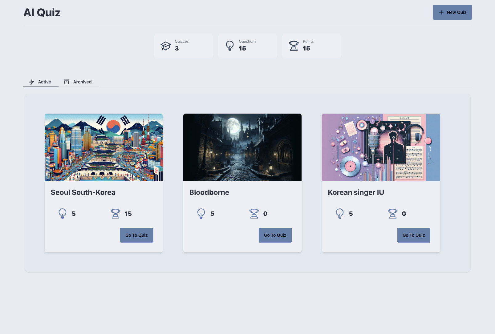

## AI Quiz

AI Quiz is a simple web application that allows users to create a quiz on any topic.
It will then generate 5 random multiple choice questions based on that topic.
It will also generate an image for the quiz card.

## Features
- Create a quiz on any topic
- Generate 5 random multiple choice questions based on that topic
- Generate an image for the quiz card
- View statistics: amount of quizzes created, amount of questions created, total amount of points
- View all quizzes
- Archive/Unarchive a quiz
- Remove a quiz
- Reset the points of a quiz

## Tech Stack
- Laravel 11
- LiveWire 3
- maryUI 1.25
- openai-php/laravel 0.8.1

## Installation
1. Clone the repository
2. Run `composer install`
3. Run `npm install`
4. Run `npm run dev`
5. Create a new database
6. Run `php artisan migrate`
6. Copy the `.env.example` file to `.env`
7. Update the `.env` file with your database credentials
8. Update the `OPENAI_API_KEY` in the `.env` file with your OpenAI API key
9. Update the `OPENAI_API_SECRET` in the `.env` file with your OpenAI API secret
10. Run the queue worker `php artisan queue:work` (images are created on the queue)
11. Enjoy!
